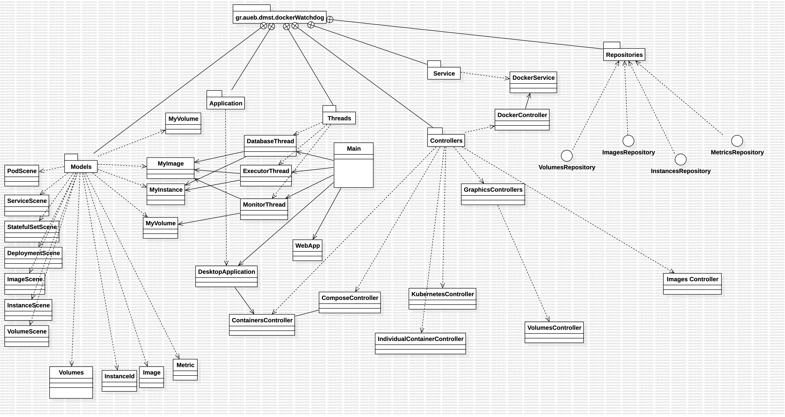
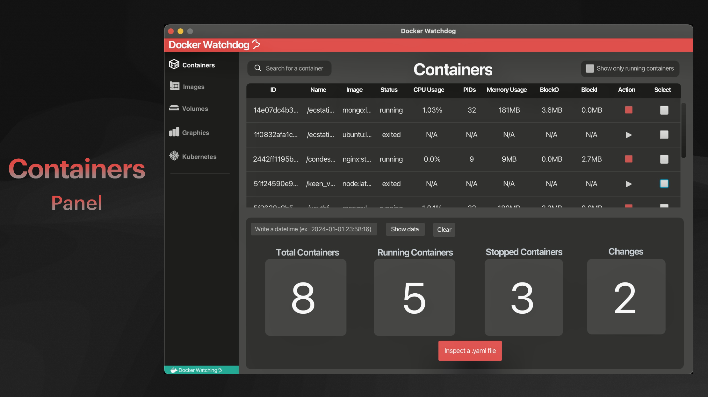
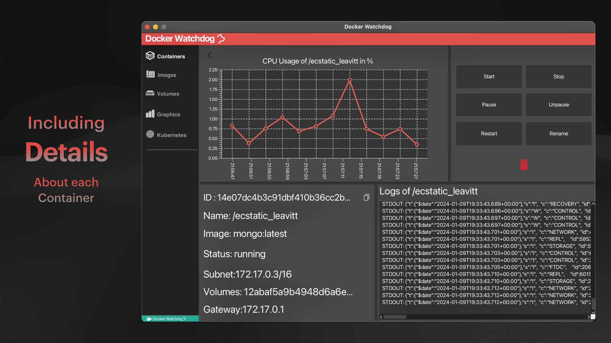
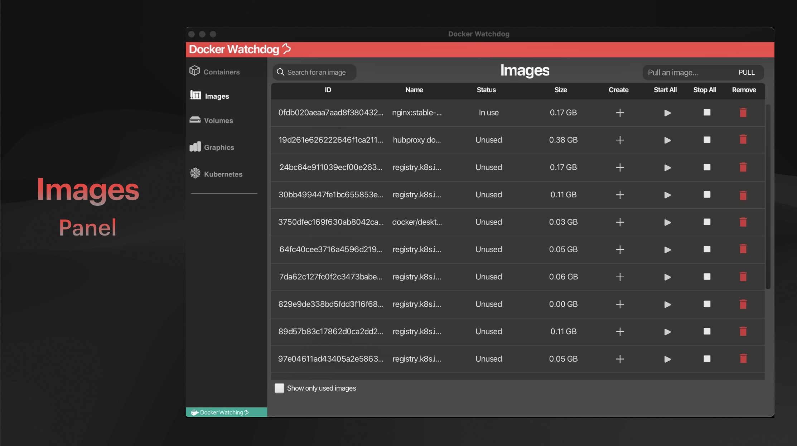
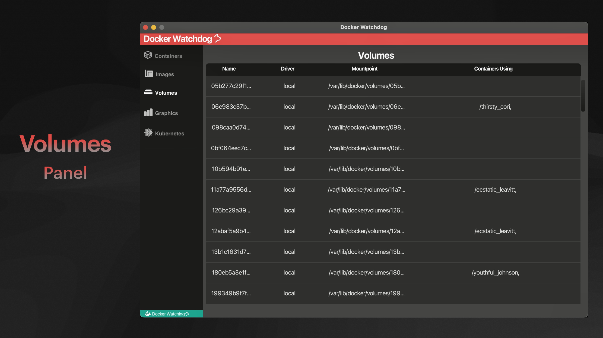
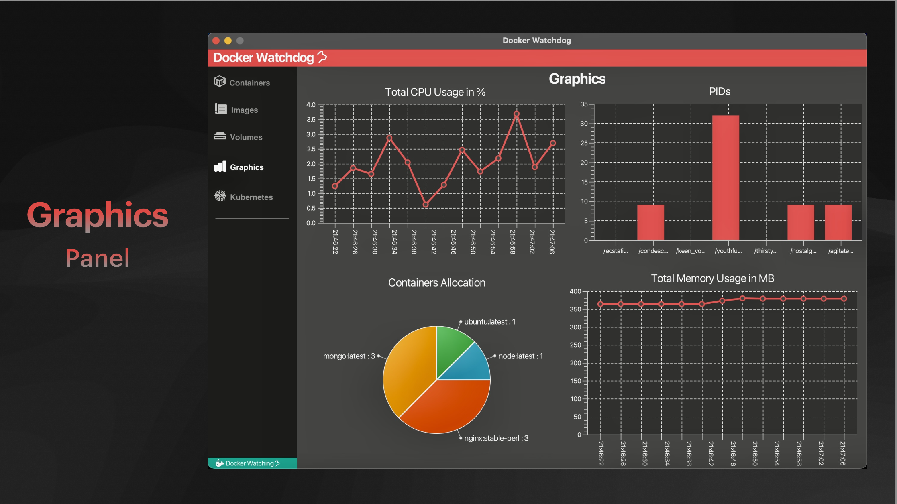
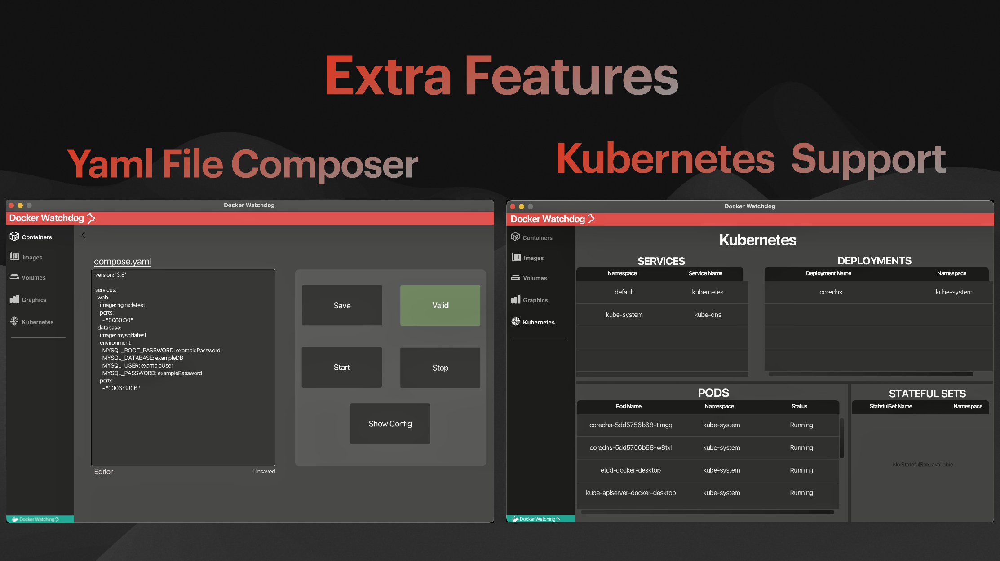

# Watchdog - Docker Monitoring Application v0.1

## Description

Watchdog is a desktop Spring Boot application designed to monitor your docker cluster and let you interact with your containers and images in an intuitive way. In this version the extracted data is stored in a local mySQL database. It uses callbacks to get data from your docker deamon and it dynamically creates data-tranfer-objects that are pushed to the database. After, a springboot application uses the REST protocol to extract the data-tranfer-objects back into the desktop application and display them in a user-friendly way while also giving the user the ability to interact with his containers and images using designated endpoints.

## Getting Started

To run the application:

**A.** Ensure Java and Maven are installed.


**B.** Depending on your platform:


**For MacOS:**

1. Download MYSQL server on your computer.
2. Set up a new connection for your database.
3. Export connection NAME, USERNAME, PASSWORD as environment variables:

    Open the terminal and type the following commands to open the shell profile file:

    For bash shell:
    ```bash
    nano ~/.bashrc
    ```

    For zsh shell:
    ```bash
    nano ~/.zshrc
    ```

    Add these lines at the end of the file:
    ```bash
    export DOCKER_DB_NAME="your_database_name"
    export DOCKER_DB_USERNAME="your_username"
    export DOCKER_DB_PASSWORD="your_password"
    ```

    Press Ctrl + X to close the editor, followed by Y to save changes, and Enter to confirm the file name. To make these changes take effect, close and reopen your terminal or source the profile file using one of the following commands:

    For bash shell:
    ```bash
    source ~/.bashrc
    ```

    For zsh shell:
    ```bash
    source ~/.zshrc
    ```


**For Windows:**

1. Download MYSQL server on your computer.
2. Set up a new connection for your database.
3. Export connection NAME, USERNAME, PASSWORD as environment variables:

    Open Command Prompt as an administrator.

    To set the environment variables, use the setx command followed by the variable name and its value. For example:

    ```cmd
    setx DOCKER_DB_NAME "your_database_name"
    setx DOCKER_DB_USERNAME "your_username"
    setx DOCKER_DB_PASSWORD "your_password"
    ```

    Please replace "your_database_name", "your_username", and "your_password" with your actual database name, username, and password.

    Close and reopen Command Prompt to make sure the changes take effect.


**C.** Ensure docker desktop is running and kubernetes is enabled in settings


**D.** Clone the repository.
```bash
    git clone https://github.com/zarkk01/docker-watchdog.git
```
**E.** Navigate to the root directory and run `mvn install`

**F.**  Run `java -jar target/watchdog.jar`
## Project Structure

```
.
├── README.md
├── pom.xml
├── src
│   ├── main
│   │   ├── java
│   │   │   └── gr
│   │   │       └── aueb
│   │   │           └── dmst
│   │   │               └── dockerWatchdog
│   │   │                   ├── Application
│   │   │                   │   └── DesktopApp.java
│   │   │                   ├── Controllers
│   │   │                   │   ├── ComposeController.java
│   │   │                   │   ├── ContainersController.java
│   │   │                   │   ├── DockerController.java
│   │   │                   │   ├── GraphicsController.java
│   │   │                   │   ├── ImagesController.java
│   │   │                   │   ├── IndividualContainerController.java
│   │   │                   │   ├── KubernetesController.java
│   │   │                   │   └── VolumesController.java
│   │   │                   ├── Exceptions
│   │   │                   │   ├── ContainerCreationException.java
│   │   │                   │   ├── ContainerNameConflictException.java
│   │   │                   │   ├── ContainerNotFoundException.java
│   │   │                   │   ├── ContainerNotModifiedException.java
│   │   │                   │   ├── ContainerRunningException.java
│   │   │                   │   ├── DatabaseOperationException.java
│   │   │                   │   ├── EventHandlingException.java
│   │   │                   │   ├── ImageNotFoundException.java
│   │   │                   │   ├── ListFillingException.java
│   │   │                   │   └── LiveStatsException.java
│   │   │                   ├── Main.java
│   │   │                   ├── Models
│   │   │                   │   ├── DeploymentScene.java
│   │   │                   │   ├── Image.java
│   │   │                   │   ├── ImageScene.java
│   │   │                   │   ├── Instance.java
│   │   │                   │   ├── InstanceId.java
│   │   │                   │   ├── InstanceScene.java
│   │   │                   │   ├── Metric.java
│   │   │                   │   ├── MyImage.java
│   │   │                   │   ├── MyInstance.java
│   │   │                   │   ├── MyVolume.java
│   │   │                   │   ├── PodScene.java
│   │   │                   │   ├── ServiceScene.java
│   │   │                   │   ├── StatefulSetScene.java
│   │   │                   │   ├── Volume.java
│   │   │                   │   └── VolumeScene.java
│   │   │                   ├── Repositories
│   │   │                   │   ├── ImagesRepository.java
│   │   │                   │   ├── InstancesRepository.java
│   │   │                   │   ├── MetricsRepository.java
│   │   │                   │   └── VolumesRepository.java
│   │   │                   ├── Services
│   │   │                   │   └── DockerService.java
│   │   │                   ├── Threads
│   │   │                   │   ├── DatabaseThread.java
│   │   │                   │   ├── ExecutorThread.java
│   │   │                   │   └── MonitorThread.java
│   │   │                   └── WebApp.java
│   │   └── resources
│   │       ├── application.properties
│   │       ├── composeScene.fxml
│   │       ├── containersScene.fxml
│   │       ├── graphicsScene.fxml
│   │       ├── images
│   │       │   ├── Box.png
│   │       │   ├── BoxClick.png
│   │       │   ├── BoxHover.png
│   │       │   ├── CheckBox.png
│   │       │   ├── CheckBoxClick.png
│   │       │   ├── CheckBoxHover.png
│   │       │   ├── Copy.png
│   │       │   ├── CopyClick.png
│   │       │   ├── CopyHover.png
│   │       │   ├── Pause.png
│   │       │   ├── PauseClick .png
│   │       │   ├── PauseHover.png
│   │       │   ├── back.png
│   │       │   ├── backClick.png
│   │       │   ├── backHover.png
│   │       │   ├── bin.png
│   │       │   ├── binClick.png
│   │       │   ├── binHover.png
│   │       │   ├── binRed.png
│   │       │   ├── container.png
│   │       │   ├── containerGrey.png
│   │       │   ├── create.png
│   │       │   ├── createHover.png
│   │       │   ├── docker.png
│   │       │   ├── graphics.png
│   │       │   ├── graphicsGrey.png
│   │       │   ├── image.png
│   │       │   ├── imageGrey.png
│   │       │   ├── kubernetes.png
│   │       │   ├── kubernetesGrey.png
│   │       │   ├── play.png
│   │       │   ├── playClick.png
│   │       │   ├── playHover.png
│   │       │   ├── search.png
│   │       │   ├── stop.png
│   │       │   ├── stopClick.png
│   │       │   ├── stopHover.png
│   │       │   ├── stopRed.png
│   │       │   ├── volumes.png
│   │       │   ├── volumesGrey.png
│   │       │   └── watchdog.png
│   │       ├── imagesScene.fxml
│   │       ├── individualContainerScene.fxml
│   │       ├── kubernetesScene.fxml
│   │       ├── styles
│   │       │   ├── buttons.css
│   │       │   ├── chartColor.css
│   │       │   ├── containersHover.css
│   │       │   ├── curvedPane.css
│   │       │   ├── darkButtons.css
│   │       │   ├── graphicsHover.css
│   │       │   ├── hoverPane.css
│   │       │   ├── imagesHover.css
│   │       │   ├── kubernetesHover.css
│   │       │   ├── pieChart.css
│   │       │   ├── redButton.css
│   │       │   ├── splitPane.css
│   │       │   ├── styles.css
│   │       │   ├── textArea.css
│   │       │   └── volumesHover.css
│   │       └── volumesScene.fxml
│   └── test
│      
└── target

```

## Project Structure and Package/Files Descriptions

Watchdog is structured into several packages, each with a specific role in the application:

- **`gr.aueb.dmst.dockerWatchdog`**:
    - **`Main.java`**: The main entry point of the application.

- **`Application`**:
    - Contains the class that boots up the desktop app.

- **`Controllers`**:
    - Contains the controller for the API and many Controllers related to the scenes of the desktop app.

- **`Exceptions`**:
    - Contains custom exception classes .

- **`Models`**:
    - Contains model classes for desktop and databse tables as well as the data-transfer-object classes.

- **`Repositories`**:
    - Contains repositories for interacting with the database for each entity.

- **`Services`**:
    - Contains the service for the API that implemets the practical logic of each endpoint. 

- **`Threads`**:
    - Contains the 3 threads that are constantly running in the applicaton.

- **`resources`**:
    - Contains application properties and resources.

- **`test`**:
    - Test package containing test cases.

## REST Endpoints

| Endpoint                            | HTTP Method | Description                                              |
|-------------------------------------|-------------|----------------------------------------------------------|
| `/images`                           | GET         | Retrieves all pulled Docker images                       |
| `/volumes`                          | GET         | Retrieves all Docker volumes                             |
| `/images/create/{imageName}`        | POST        | Creates a container for the specified image              |
| `/containers/{containerId}/start`   | POST        | Starts the specified container                           |
| `/containers/{containerId}/stop`    | POST        | Stops the specified container                            |
| `/containers/{containerId}/restart` | POST        | Restarts the specified container                         |
| `/containers/{containerId}/delete`  | POST        | Deletes the specified container                          |
| `/containers/{containerId}/rename`  | POST        | Renames the specified container                          |
| `/containers/{containerId}/pause`   | POST        | Pauses the specified container                           |
| `/containers/{containerId}/unpause` | POST        | Unpauses the specified container                         |
| `/containers/instances`             | GET         | Retrieves all the containers in your cluster             |
| `/containers/metrics`               | GET         | Retrieves metrics for a given timestamp                  |
| `/containers/lastMetricId`          | GET         | Returns the metric Id with the highest value             |
| `/containers/{containerId}/info`    | GET         | Checks if a container exists (for testing)               |
| `/containers/startAll/{imageName}`  | POST        | Starts all containers that belong to the specified image |
| `/containers/stopAll/{imageName}`   | POST        | Stops all containers that belong to the specified image  |
| `/images/pull/{imageName}`          | POST        | Pulls an image                                           |
| `/images/remove/{imageName}`        | POST        | Removes the image with the specified name                |

## Libraries and Versions

| Library                                                 | Version     | Scope   |
|---------------------------------------------------------|-------------|---------|
| org.springframework.boot:spring-boot-starter-web        | 3.2.0       | compile |
| javax.annotation:javax.annotation-api                   | 1.3.2       | compile |
| com.github.docker-java:docker-java                      | 3.3.4       | compile |
| junit:junit                                             | 4.13.2      | test    |
| mysql:mysql-connector-java                              | 8.0.28      | compile |
| ch.qos.logback:logback-classic                          | 1.4.12      | compile |
| org.springframework.boot:spring-boot-starter-data-jpa   | 3.2.0       | compile |
| javax.xml.bind:jaxb-api                                 | 2.3.1       | compile |
| org.openjfx:javafx-base                                 | 21          | compile |
| org.openjfx:javafx-controls                             | 21          | compile |
| org.openjfx:javafx-graphics                             | 21          | compile |
| org.openjfx:javafx-fxml                                 | 21          | compile |
| org.glassfish.jaxb:jaxb-runtime                         | 2.3.1       | compile |
| com.squareup.okhttp3:okhttp                             | 4.12.0      | compile |
| io.kubernetes:client-java                               | 19.0.0      | compile |
| org.yaml:snakeyaml                                      | 2.2         | compile |
| org.apache.logging.log4j:log4j-core                     | 3.0.0-beta1 | compile |
| org.testng:testng                                       | 7.9.0       | compile |
| org.junit.jupiter:junit-jupiter                         | 5.10.0      | test    |
| org.mockito:mockito-core                                | 5.7.0       | test    |
| org.springframework.boot:spring-boot-test-autoconfigure | 3.2.0       | test    |
| org.springframework:spring-test                         | 6.1.1       | test    |
| org.testfx:testfx-junit                                 | 4.0.1-alpha | test    |

## Code UML


## Visuals







Authors:

[Ioannis Tampakis](mailto:giannistampakis04@gmail.com),
[Thodoris Zarkalis](mailto:zarkalhs@gmail.com),
[Iasonas Passam](mailto:),
[Dionysis Glytsos](mailto:)

Contributors:

## Contributing

Pull requests are welcome. For major changes, please open an issue first
to discuss what you would like to change.

Please make sure to update tests as appropriate.
